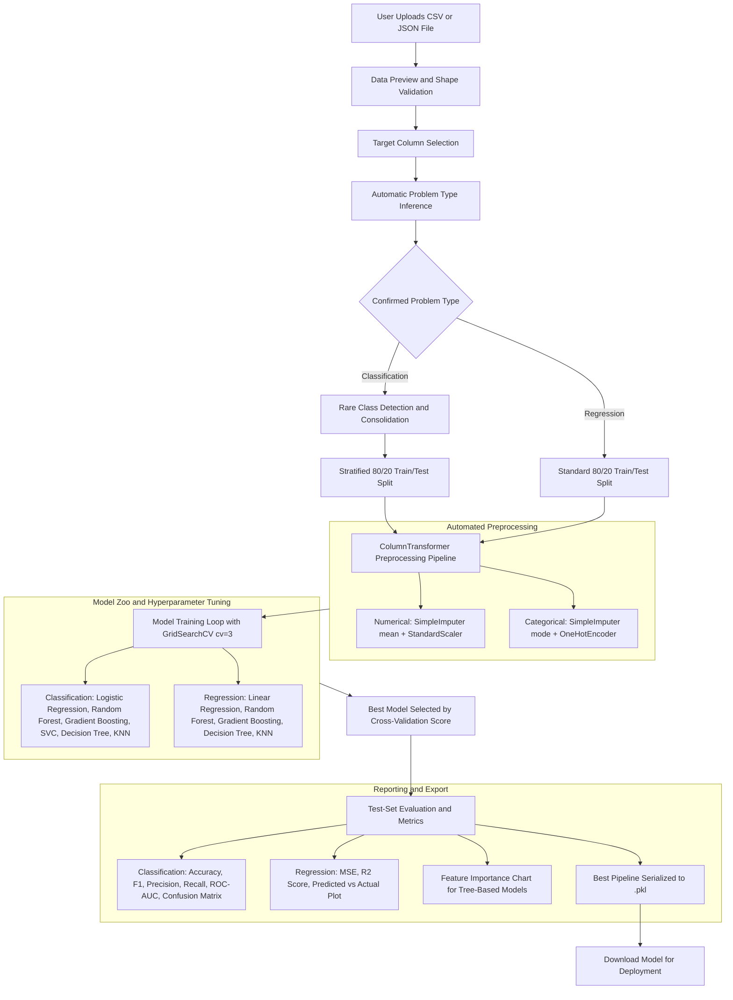

# Intelligent AutoML Agent

[](https://www.python.org/)
[](https://streamlit.io/)
[](https://scikit-learn.org/)
[](https://opensource.org/licenses/MIT)

An end-to-end automated machine learning platform built with **Streamlit** and **Scikit-Learn**. It handles the complete ML pipeline — from file ingestion and preprocessing through model training, hyperparameter tuning, evaluation, and serialized model export — through an interactive browser-based interface.

---

## Table of Contents

- [Overview](#overview)
- [Application Workflow](#application-workflow)
- [Features](#features)
- [Supported Models and Hyperparameters](#supported-models-and-hyperparameters)
- [Evaluation Metrics](#evaluation-metrics)
- [Project Structure](#project-structure)
- [Installation](#installation)
- [Usage](#usage)
- [License](#license)
- [Author](#author)

---

## Overview

The Intelligent AutoML Agent is a Streamlit web application that enables users without deep ML expertise to train, evaluate, and export machine learning models. Users upload a dataset in CSV or JSON format, select a target column, confirm the problem type, and the system handles all downstream steps automatically preprocessing, model training with cross-validated hyperparameter tuning, evaluation, visualization, and `.pkl` export.

The backend ML logic resides in `automl_core.py` and the Streamlit UI and visualization layer resides in `agent.py`.

---

## Application Workflow



---

## Features

### Data Ingestion
- Upload tabular data as **CSV** or **JSON** files directly through the browser interface.
- Immediate data preview showing the first five rows and dataset dimensions (rows x columns) upon upload.

### Automated Preprocessing
- **Numerical columns**: Missing values filled using mean imputation (`SimpleImputer`), then standardized using `StandardScaler`.
- **Categorical columns**: Missing values filled using mode imputation (`SimpleImputer`), then encoded using `OneHotEncoder` with `handle_unknown='ignore'`.
- Both transformers are applied via a `ColumnTransformer` pipeline, with `remainder='passthrough'` for any untyped columns.

### Rare Class Handling (Classification)
- Before splitting, the system inspects the target column's class distribution.
- Any class with fewer than 2 samples is automatically merged into a single `'Rare_Class'` category.
- This prevents `train_test_split` with `stratify` from failing on underrepresented classes.

### Automatic Problem Type Inference
- When a target column is selected, the system inspects its dtype and unique value ratio:
  - **Numeric target with low cardinality** (unique/total < 10% and fewer than 50 unique values): suggests Classification.
  - **Numeric target with high cardinality**: suggests Regression.
  - **Categorical target** (object, bool, category dtypes): suggests Classification.
- The user can accept the suggestion or override it manually before running.

### Model Training and Hyperparameter Tuning
- Each candidate model is wrapped in a full `sklearn.pipeline.Pipeline` with the preprocessor and estimator.
- `GridSearchCV` is applied with `cv=3` and `n_jobs=1` to search the defined hyperparameter grid for each model.
- The model with the highest cross-validation score is retained as the best model.

### Evaluation and Visualizations
- **Classification**:
  - Metrics: Accuracy, weighted F1-Score, weighted Precision, weighted Recall, ROC-AUC (binary or OVR weighted for multiclass).
  - Visualizations: Confusion matrix heatmap (Seaborn), Top-10 Feature Importance bar chart (for tree-based models).
- **Regression**:
  - Metrics: Mean Squared Error (MSE), R² Score.
  - Visualizations: Predicted vs. Actual scatter plot with ideal fit line, Top-10 Feature Importance bar chart (for tree-based models).
- Model comparison table showing test-set metrics across all trained models with conditional formatting (highest values highlighted).

### Model Export
- The best estimator pipeline (preprocessor + model) is serialized using `pickle` and saved as `best_ml_model_{problem_type}.pkl`.
- A one-click download button is provided in the UI to retrieve the `.pkl` file.

---

## Supported Models and Hyperparameters

### Classification

| Model | Hyperparameter Grid | CV Scoring Metric |
| :--- | :--- | :--- |
| Logistic Regression | `C: [0.1, 1.0, 10.0]`, `solver: lbfgs`, `max_iter: 1000` | Accuracy |
| Random Forest Classifier | `n_estimators: [50, 100]`, `max_depth: [None, 10]` | Accuracy |
| Gradient Boosting Classifier | `n_estimators: [50, 100]`, `learning_rate: [0.01, 0.1]` | Accuracy |
| Support Vector Classifier | `C: [0.1, 1.0]`, `kernel: [linear, rbf]`, `probability: True` | Accuracy |
| K-Nearest Neighbors Classifier | `n_neighbors: [3, 5]` | Accuracy |
| Decision Tree Classifier | `max_depth: [None, 5, 10]` | Accuracy |

### Regression

| Model | Hyperparameter Grid | CV Scoring Metric |
| :--- | :--- | :--- |
| Linear Regression | Default (no grid search) | Neg. Mean Squared Error |
| Random Forest Regressor | `n_estimators: [50, 100]`, `max_depth: [None, 10]` | Neg. Mean Squared Error |
| Gradient Boosting Regressor | `n_estimators: [50, 100]`, `learning_rate: [0.01, 0.1]` | Neg. Mean Squared Error |
| K-Nearest Neighbors Regressor | `n_neighbors: [3, 5]` | Neg. Mean Squared Error |
| Decision Tree Regressor | `max_depth: [None, 5, 10]` | Neg. Mean Squared Error |

---

## Evaluation Metrics

### Classification
| Metric | Computation |
| :--- | :--- |
| **Accuracy** | `sklearn.metrics.accuracy_score` |
| **F1-Score** | `f1_score(average='weighted', zero_division=0)` |
| **Precision** | `precision_score(average='weighted', zero_division=0)` |
| **Recall** | `recall_score(average='weighted', zero_division=0)` |
| **ROC-AUC** | Binary: `roc_auc_score(y_test, y_proba[:, 1])` / Multiclass: OVR weighted |

### Regression
| Metric | Computation |
| :--- | :--- |
| **MSE** | `sklearn.metrics.mean_squared_error` |
| **R² Score** | `sklearn.metrics.r2_score` |

---

## Project Structure

```
AutoML_Agent/
├── LICENSE                    # MIT License
├── README.md                  # Project Documentation
└── Main File/
    ├── agent.py               # Streamlit UI, visualizations, and session management
    ├── automl_core.py         # Preprocessing, model training, tuning, and evaluation engine
    ├── requirements.txt       # Python package dependencies
```

---

## Installation

### Prerequisites
- Python 3.8 or higher
- Git

### 1. Clone the Repository
```bash
git clone https://github.com/dhrumil1128/AutoML_Agent.git
cd AutoML_Agent
```

### 2. Create and Activate a Virtual Environment

**Windows (PowerShell):**
```powershell
python -m venv venv
.\venv\Scripts\activate
```

**macOS / Linux:**
```bash
python3 -m venv venv
source venv/bin/activate
```

### 3. Install Dependencies
```bash
pip install -r "Main File/requirements.txt"
```

---

## Usage

Navigate into the `Main File` directory and launch the Streamlit application:

```bash
cd "Main File"
streamlit run agent.py
```

The application opens at `http://localhost:8501`. Follow the four steps in the interface:

1. **Step 1 — Ingest Your Dataset**: Upload a `.csv` or `.json` file. A data preview and shape summary are displayed immediately.
2. **Step 2 — Configure AutoML**: Select the target column. The system infers and suggests a problem type (Classification or Regression). Confirm or override, then click **Run AutoML**.
3. **Step 3 — Review Results**: Inspect the best model name, cross-validation score, best hyperparameters, test-set metrics, model comparison table, and diagnostic plots.
4. **Step 4 — Download Model**: Download the serialized `.pkl` pipeline file for use in production or other Python environments.

---

## License

Distributed under the **MIT License**. See the `LICENSE` file for full terms.

---

## Author

**Dhrumil Pawar**

- LinkedIn: [linkedin.com/in/dhrumil-pawar](https://www.linkedin.com/in/dhrumil-pawar/)
- GitHub: [github.com/dhrumil1128](https://github.com/dhrumil1128)
